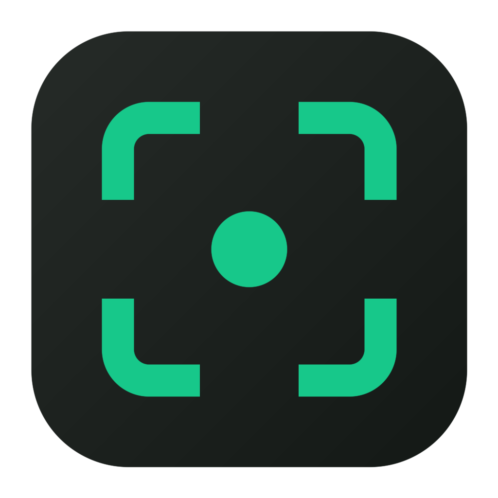

<div align="center">
  

# Snapkit

**Capture. Redact. Ship — safely.**

A developer-first, cross-platform screenshot & screen-recording tool with
**local auto-redaction of secrets**. One click and your screenshot is safe to share —
no email addresses, no API keys, no tokens leaking into Slack threads.

**Everything runs on your machine. Your screenshots never leave your device.**

<a href="../../releases">Download</a> ·
<a href="#-install">Install</a> ·
<a href="#-usage">Usage</a> ·
<a href="#-under-the-hood">Under the hood</a> ·
<a href="ROADMAP.md">Roadmap</a>


</div>

---

## Why Snapkit

Every screenshot tool can draw an arrow. Snapkit is built around a different problem:
**screenshots leak secrets**. Terminal output with an `AWS_SECRET_KEY`, a bug report with a
JWT in the network tab, a config file with someone's email — pasted in a public channel.

Snapkit runs OCR **locally**, finds the sensitive bits, and blurs them before you share:

- **Auto-redaction** — local Tesseract OCR + pattern matching finds emails, JWTs, AWS/GitHub/
  Slack/Stripe/Google/OpenAI-style keys, IPs, `Bearer` tokens, PEM private-key headers and
  `password:`/`secret=` assignments — even when they span multiple words. You review the
  proposed regions, click once, they're pixelated.
- **Subject extraction** — iPhone-style: lift a subject out of a screenshot as a transparent
  sticker, powered by ONNX segmentation running **on-device**.
- **No cloud, no account, no telemetry** — the OCR models, the segmentation model, the fonts:
  everything ships with the app. Airplane mode changes nothing.

## Features

**Capture**

- Area (multi-display simultaneous overlays, frozen-frame WYSIWYG), full screen, single window
  (picker with live thumbnails), **scrolling capture** (you scroll, frames get stitched into
  one tall image)
- Global shortcuts, all configurable · capture flash feedback · tray-resident

**Annotate**

- Arrow, line, freehand pen, rectangle, text, Paint-style highlighter, step markers (auto-numbered),
  pixelate blur
- **Lasso**: free-form select → copy with transparency · **Smart cut**: lasso around a subject →
  segmentation copies just the subject
- Serializable undo/redo, keyboard-first (one key per tool)

**Record**

- Region recording → **WebM** (up to 5 min) or **GIF** (up to 30 s), saved wherever you want

**Export**

- Copy to clipboard · **styled copy** (padded gradient backdrop: Emerald/Graphite/Steel/Paper) ·
  save PNG/JPG · toast confirmations

**Preferences**

- Shortcuts, dark/light/system theme, OCR languages (English, Italiano, Deutsch, Français,
  Español — bundled), export folder & format, recording format, auto-redact after capture

## 📦 Install

### Downloads

Grab the latest installer from [**Releases**](../../releases):

| OS                    | File                              | Note                                                                                        |
| --------------------- | --------------------------------- | ------------------------------------------------------------------------------------------- |
| macOS (Apple Silicon) | `Snapkit-x.y.z-arm64.dmg`         | Unsigned for now: right-click the app → **Open** (or `xattr -cr /Applications/Snapkit.app`) |
| Windows (x64)         | `Snapkit Setup x.y.z.exe`         | SmartScreen will warn (unsigned): **More info → Run anyway**                                |
| Linux                 | `Snapkit-x.y.z.AppImage` / `.deb` | `chmod +x` the AppImage and run                                                             |

> macOS asks for **Screen Recording** permission on first capture
> (System Settings → Privacy & Security), then requires an app relaunch — that's an OS rule.

### Build from source

Requirements: **Node.js ≥ 20.19** and npm.

```bash
git clone https://github.com/simiriva95/snapkit.git
cd snapkit
npm install
# if npm skipped electron's binary download (some environments do):
node node_modules/electron/install.js

npm run dev            # run with hot reload
npm run package        # installer for YOUR OS → dist/
npm run package:winmac # .dmg + windows .exe in one go (from macOS)
```

First run downloads the on-device segmentation model (~76 MB, one time) into the project —
after that, everything is fully offline.

## 🚀 Usage

| Action                     | Default shortcut          |
| -------------------------- | ------------------------- |
| Capture area               | `⌘⇧2` / `Ctrl+Shift+2`    |
| Capture full screen        | `⌘⇧1` / `Ctrl+Shift+1`    |
| Capture window             | `⌘⇧3` / `Ctrl+Shift+3`    |
| Scrolling capture / Record | tray menu or home buttons |

In the editor: `V` select · `A` arrow · `L` line · `P` pen · `R` rectangle · `T` text ·
`H` highlighter · `S` step marker · `B` blur · `O` lasso · `W` smart cut ·
`⌘Z`/`⇧⌘Z` undo/redo · `⌘C` copy · `⇧⌘C` styled copy · `⌘S` save.

Typical flow: `⌘⇧2` → drag → annotate → **Auto-redact** (shield button) → review the dashed
regions (click one to exclude it) → **Blur N** → `⌘C` → paste. Done, and nothing sensitive
made the trip.

## 🔬 Under the hood

```
src/
  main/       window/tray/shortcuts, capture orchestration, export, prefs,
              license, auto-update, app:// protocol (serves the packaged renderer)
  preload/    contextBridge — typed API surface, no nodeIntegration
  renderer/   React: home, selection overlays, Konva editor, picker,
              control bar, hidden recorder
  shared/     typed IPC contract, redaction patterns, prefs/license models
```

| Concern      | Choice                                                                  |
| ------------ | ----------------------------------------------------------------------- |
| Shell        | Electron + electron-vite (strict process separation, sandbox, prod CSP) |
| UI           | React 19 · Tailwind CSS v4 · Konva canvas                               |
| OCR          | Tesseract.js — worker/WASM/language packs self-hosted                   |
| Segmentation | @imgly/background-removal — ONNX, self-hosted, quantized model          |
| Recording    | getDisplayMedia + canvas crop → MediaRecorder (WebM) / gifenc (GIF)     |
| Persistence  | electron-store                                                          |
| Packaging    | electron-builder (dmg/zip, NSIS, AppImage/deb) + electron-updater       |

Details worth stealing:

- **Capture-first selection**: the screen is grabbed _before_ the overlay opens — you select
  on a frozen frame, so what you pick is exactly what you get.
- **`app://` custom protocol**: packaged builds serve the renderer over a privileged scheme so
  `fetch()`, workers and absolute paths behave exactly like in dev (`file://` breaks them).
- **Scroll stitching**: per-row luminance hashes + best-overlap search appends only new rows;
  full-overlap frames are dropped (unit-tested pure functions).
- **Pure, tested cores**: undo/redo history, redaction patterns, stitching, license crypto —
  all plain functions with vitest suites (`npm test`).
- **Offline licensing** (dormant in the free build): Ed25519-signed keys verified against a
  public key baked at build time — no activation server. See [docs/selling.md](docs/selling.md).

## 🔒 Privacy

- No network calls at runtime. No telemetry, no crash reporting, no account.
- OCR, segmentation, recording, export: all local.
- The only outbound connection the app can make is the auto-update check against GitHub
  Releases in packaged builds — and it fails silently offline.

## Development

```bash
npm run dev         # HMR dev session
npm test            # vitest — history, redaction, stitching, license crypto
npm run typecheck   # strict TS, main + renderer
npm run lint        # eslint flat config
npm run gen:appicon # regenerate build/icon.png (programmatic, no design tools)
npm run gen:icon    # regenerate the tray template icons
```

CI builds installers for the three OSes on every `v*` tag ([release.yml](.github/workflows/release.yml)).

## Roadmap

Cloud share links (opt-in, client-side encrypted), sync, team features, plugin API —
see [ROADMAP.md](ROADMAP.md) for the phased plan and what was deliberately left out.

## License

Source-available: the code is public to read, build and use personally.
Commercial licensing/redistribution is reserved while the monetization model settles —
see [docs/selling.md](docs/selling.md). This may relax later.
